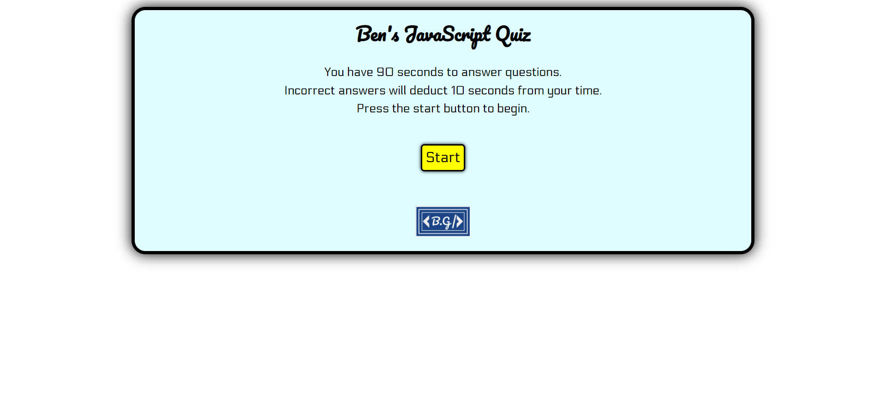

Ben's JavaScript Quiz

A short quiz I designed on the fundamentals of Javascript.

The quiz features dynamically updated HTML and CSS powered by JavaScript.
The quiz is timed and you can enter your high scores upon completion.
High scores are saved to local storage and are visible next time you visit the site.

    - When you click the start button you are presented with a question and the timer begins.
    - When you answer a question you are presented with the next question.
    - If a question is answered incorrectly there is a time penalty.
    - When you complete the quiz or run out of time the game is over and you are presented with an opportunity to add your high score and to try again.

https://bgrowcott.github.io/bg-magical-js-quiz/

